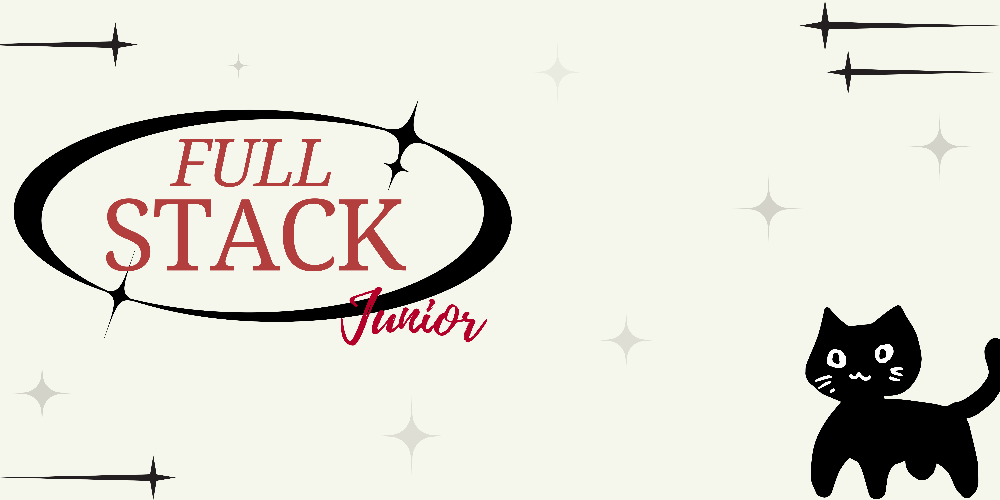

˚₊‧ა. Valerie .໒‧₊˚

 
 
 
 
 
 
/\_/\  

( o.o )

#
## ✩‧₊ ¡Bienvenid@ a mi perfil! 

Hola, soy Valerie Lasso, una apasionada aprendiz del mundo del desarrollo de software. Aquí comparto mi evolución a través de proyectos y repositorios que reflejan mi aprendizaje, crecimiento y experiencia en diferentes lenguajes y tecnologías.

Me destaco por mi capacidad de comunicación en público. Lo que me permite conectar con audiencia de manera efectiva. Además soy una persona creativa y proactiva. con una gran capacidad para generar ideas innovadoras. Esto me permite aportar valor y soluciones únicas en mis proyectos y colaboraciones.

Estoy dispuesta a explorar nuevas herramientas y metodologías para fortalecer mis habilidades tanto en la teoría como en la práctica.

 

##  ‧₊Tecnologías y herramientas
 

 
★ Lenguajes de programación: Python, HTML, CSS, Java, JavaScript, MySQL

★ Metodologías y prácticas: Scrum

★ Herramientas: Git, GitHub, Visual Studio Code

#

##  ‧₊Proyectos y repositorios
★ Proyectos personales: Experimentos y desarrollos para poner en práctica nuevas ideas.

★ Proyectos de aprendizaje: Repositorios creados como parte de mi formación y estudios.

★ Colaboraciones: Trabajos en equipo para potenciar el aprendizaje compartido.

## Portafolio: https://cool-cactus-61a876.netlify.app/
#

## Contacto
 /\ _ /\  
(  o.o  )  
(   ✩‧₊   )

### Transforma tus ideas en realidades impactantes , hablemos! 
valerie01liz01@gmail.com

